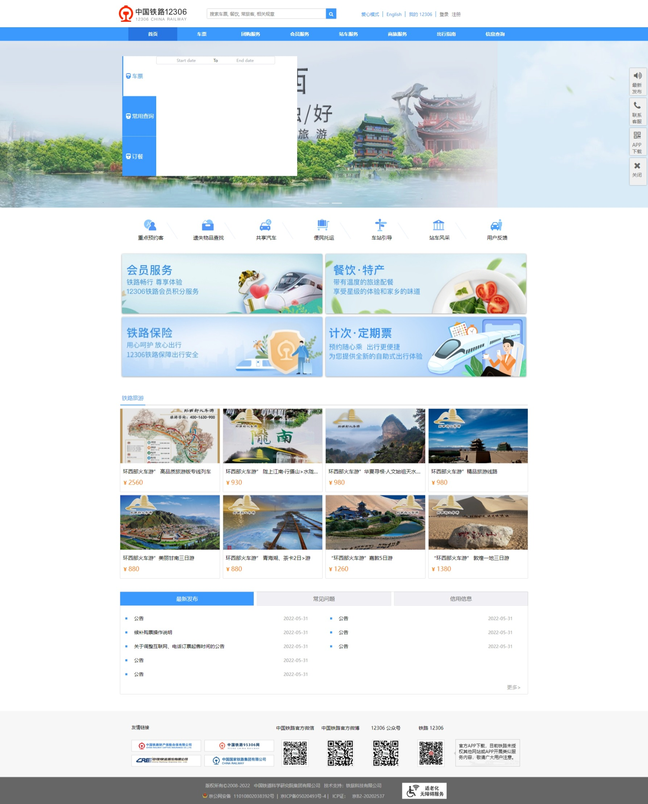
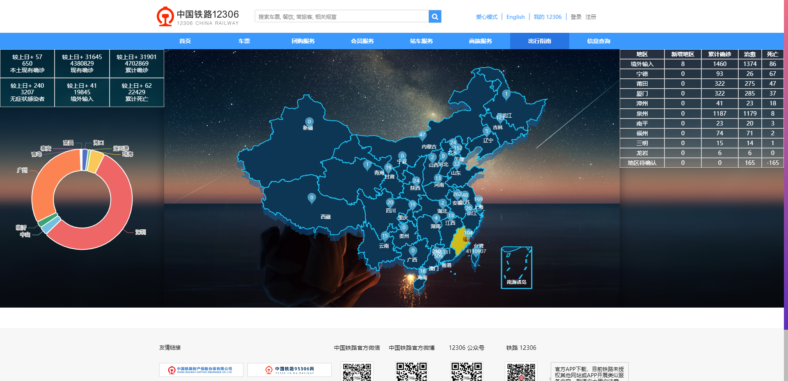
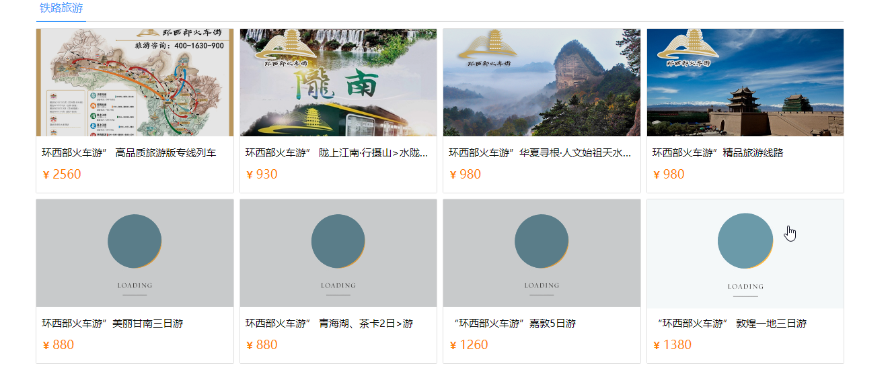
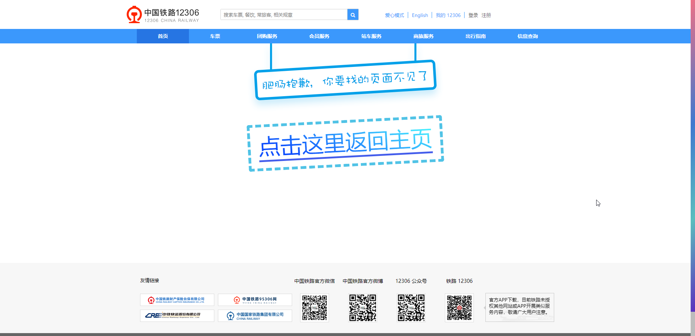

# 一个简单的仿 12306 首页的静态页面

# IMPORTANT MESSAGE

> 仅作为个人的练习项目, 不对其进行任何负责(包括编写上的缺陷等), 页面样式/布局/LOGO 复用/模仿等仅作为个人练习上的模仿, 不进行任何商业/版权上的使用, 望悉知!!!, 综上, 不对本项目负任何的责任

> 补充说明:
> 使用到的第三方接口仅供学习, 切勿滥用(且随时可能失效)
> 部分资源文件来自互联网, 仅供学习使用, 切勿他用

## 当前版本功能

- (`最新`) 使用 fontawesome-free(6.1.1) 代替旧版, 以解决 sass 单位计算的问题
  - 您可以根据需要修改 `main.ts` 下引入的依赖文件, 我只引入了 `solid` 样式
- 添加返回顶部按钮通用组件, 包含默认动画, 已默认设置常规滚动处理的回调, 且允许调整众多参数
- 添加一个简单的疫情可视化图表展示 感谢 [小满 zs 的教程]("https://www.bilibili.com/video/BV1dS4y1y7vd?p=70&spm_id_from=333.880.my_history.page.click&vd_source=68720e34574ae6c7d6a143d6c92bdac7")
  - 大致的变更部分:
    1. 在原有的基础上添加了一些小修改(在视图大小发生更改时重新渲染地图, 且套了一层节流)
    2. 受限于现有布局, 移除了折线图
- 使用 `mockjs` 模拟部分测试数据
- 主页面路由组件的切换的过渡效果(视觉上更加友好)
- 可复用的多彩背景待开发提示页面组件
- 更加视觉友好的错误页提示
- 部分样式优化
- 图片懒加载设置, 路由组件缓存上限设置-

## note:

- **项目持续更新中(未完)...**
- 这个项目要求你必须已经安装好了 nodejs 环境(>=12)
- 且已经安装好了 vue-cli 脚手架工具(>=5.0)
- 在一切无误后边可以进行本地测试和打包部署了

```sh
cd railway-page

# 安装项目依赖
npm install

# 启动开发预览服务器
npm run dev

# 打包构建
npm run build
```

- 此外你也可以修改 `package.json` 文件下的 `scripts` 区域以更改指令

## 基本展示

<div align="center">
<h3>主页</h3>


<h3>疫情可视化简单展示</h3>


<h3>图片懒加载配置</h3>


<h3>侧边栏效果</h3>


<h3>待开发页面提示</h3>


<h3>错误链接处理</h3>

</div>

## src 目录结构

```txt
├───assets              # 静态资源
│   ├───img
│   └───scss            # 默认全局样式
└───components          # 组件文件夹
    ├───announcement    # 底部通知想组件
    ├───carousel        # 轮播图
    ├───contentBody     # 主体部分包裹组件
    ├───helpBar         # 右侧帮助栏
    ├───pageFooter      # 页脚
    ├───pageHeader      # 页首
    ├───railwayLine     # 铁路旅游推荐组件
    ├───serviceBrand    # 服务板块大图推荐
    └───serviceList     # 服务列表展示
```

# Thanks

- [小满 zs](https://blog.csdn.net/qq1195566313?type=blog)
